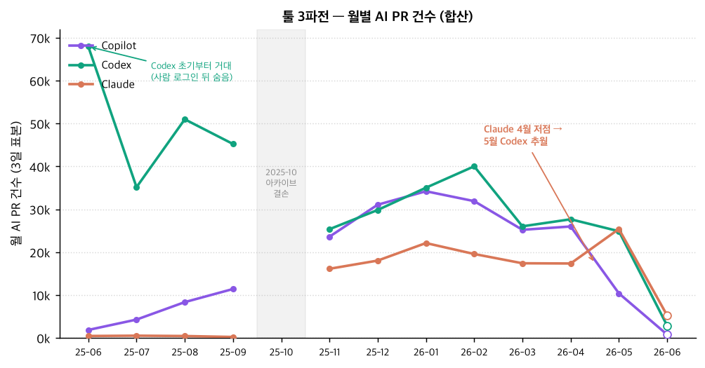
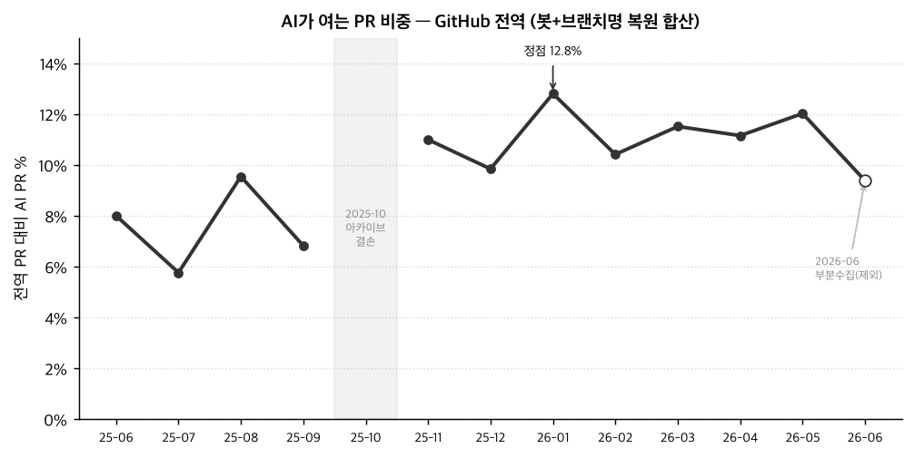
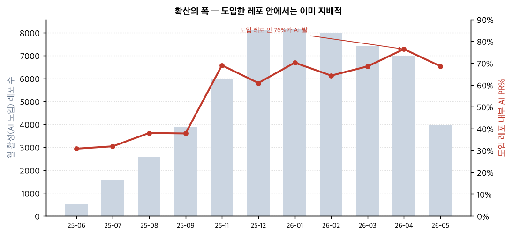
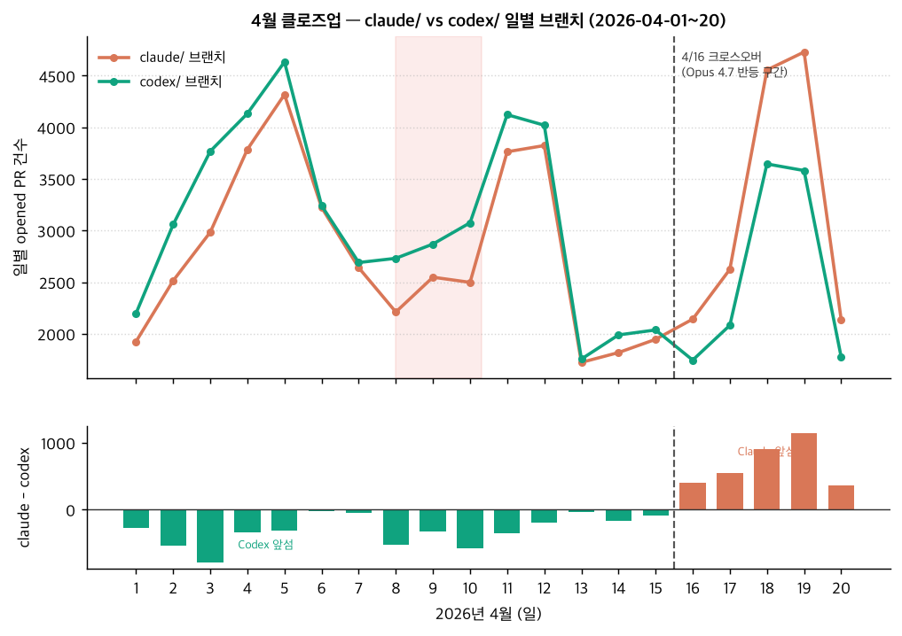

# AI 기반 개발은 얼마나 광범위해졌나 — GitHub 전수 PR 이벤트 분석

*분석일 2026-07-12 · 데이터 GH Archive(BigQuery) · 표본 2025-06~2026-06 월별 9·10·11일*

## 한 줄 요약 (2026-07-12 대개정)
브랜치명(head.ref) 신호로 사람 로그인 뒤에 숨은 Codex·Claude 클라우드를 복원하니,
**AI가 여는 PR은 GitHub 전역에서 이미 2025년 내내 6~10%, 2026-01엔 12.8%**였다(봇 계정만 볼 때의 2~3배).
"폭발"은 무(無)에서가 아니라 — **Codex는 2025-06부터 이미 거대했고**(당시 8%의 대부분),
연말에 **Copilot 코딩에이전트 + Claude Code가 합류**하며 한 단계 올라선 것이다. 정점은 2026-01.
확산의 폭도 극적 — **AI를 도입한 레포 안에서는 이미 전체 PR의 60~77%를 에이전트가 연다.**

> ⚠️ 아래 본문 1·2절의 0.15%→5% 수치는 **봇 계정만** 본 초기 분석(하한선)이며,
> 텍스트 삭제(2025-11) 후 브랜치명으로 복원한 **합산 수치가 실제 그림**이다. 개정판은 아래 "0. 합산 트렌드" 참조.

## 0. 합산 트렌드 (봇 계정 + 브랜치명 복원) — 실제 그림
2025-11부터 GH Archive가 PR 텍스트(제목·본문·diff)를 전부 제거했지만 **브랜치명(head.ref)은 100% 생존**한다.
AI 툴은 브랜치에 자기 프리픽스를 박는다(`codex/`, `claude/`, `cursor/`, `devin/`, `copilot/`) —
이 슬러그엔 작업 요약까지 남아있다(예: `codex/unify-error-handling-across-plugin`). 이를 사람 로그인 PR에 적용해 복원:

*봇 계정만 셀 때(0.15~5%)의 2~3배가 실제 합산치다. 위 그래프는 브랜치명 복원까지 반영한 합산 건수 — Codex는 2025-06부터 6.8만 건으로 이미 거대했고(봇 미사용이라 안 보였을 뿐), 연말 Copilot 봇·Claude Code가 합류해 3파전이 됐다. 회색 구간(2025-10)은 아카이브 결손, 속 빈 점(2026-06)은 부분수집이라 제외.*

- **Codex는 처음부터 거대했다:** 2025-06 codex/ 브랜치만 6.8만 건 — 봇 계정을 안 써서 안 보였을 뿐.
  이는 이전 본문 기반 분석의 "2025-06 Codex 등장→9.3%"와 독립적으로 일치(신호 교차검증).
- **2026년 3파전:** Copilot·Codex·Claude 각 2~4만 규모로 삼분. Codex 2월 정점(40k) 후 하락,
  Claude 우상향해 2026-05 Claude가 Codex 추월. (업계의 "Claude→Codex"와 반대 방향)
- **개정 서사:** 봇전용의 "30배 폭발"은 착시. AI PR은 2025년 내내 이미 6~10%(Codex 주도),
  연말 Copilot 봇+Claude Code 합류로 11~13% 스텝업, 정점 2026-01.

## 방법론과 한계 (먼저 읽을 것)
- **측정 대상 = "자율 에이전트가 자기 봇 계정으로 직접 연 PR"** (actor.login 기준):
  `Copilot`, `Claude`/`claude[bot]`, `google-labs-jules[bot]`, `devin-ai-integration[bot]`,
  `cursor[bot]`, `Codex`.
- **이 수치는 하한선이다.** ① 사람이 IDE에서 AI 도움받아 자기 이름으로 커밋하는 "AI 보조 개발"은
  지문이 안 남아 측정 불가(실제 대부분). ② Codex 클라우드·Claude Code 본체는 사람 로그인으로
  PR을 열어 봇 집계에서 빠짐. 2025-11부터 GH Archive가 PR 본문을 제거해 URL 시그니처 방식도 사망.
- 비용: actor.login+repo만 스캔(비-payload) → 전체 히스토리 스캔 총 ~33GB, 무료구간 내 **실지출 $0**.

## 1. 폭발 타이밍 — "12월 직감" 검증됨

전역 AI PR 비중은 2025년 내내 이미 6~10%였고, 연말 Copilot 봇·Claude Code 합류로 한 단계 올라서
**2026-01에 12.8%로 정점**을 찍었다. 봇 계정만 세던 초기 분석 기준으로도 이륙은 10~11월(10월 결손에
분기점이 가려짐), **12월이 절대량 기준 가장 큰 월간 급증(+1만 건)**, 1월이 정점 — "12월 폭발" 직감과 일치한다.

## 2. 확산의 폭 (핵심 발견) — 분모 희석
전역 3~5%는 전 세계 모든 레포로 희석된 값이다. **AI를 실제 도입한 레포 내부**를 보면:

- **도입한 곳에선 이미 지배적:** 에이전트를 쓰는 레포에서 전체 PR의 60~77%가 봇 발.
  즉 AI 개발은 "보조 도구"를 넘어 그 레포의 **주된 PR 생산 방식**이 됐다.
- **급속 확산:** 월별 활성 레포 524→8,167개(15배), 표본 기간 누적 **53,460개 고유 레포**가
  최소 1건 이상 AI PR을 받음. 도입 확산으로 희석배수는 206x→14x로 축소.
- **넓고 얕음:** 고유 레포의 39%가 AI PR 딱 1건, 상위 500개 레포도 전체의 16%뿐.
  소수 대형 레포 집중이 아니라 롱테일 전반으로 번지는 확산.

## 3. 툴 지형
월별 점유율(봇 이벤트 기준):

| 월 | copilot | jules | devin | claude | codex | cursor |
|---|---|---|---|---|---|---|
| 2025-09 | 83.6% | 9.2% | 4.2% | 0.1% | 0% | 3.0% |
| 2026-01 | 79.1% | **19.4%** | 0.9% | 0.4% | 0% | 0.1% |
| 2026-04 | 93.8% | 0.7% | **3.1%** | 1.5% | 0.5% | 0.4% |

- **GitHub Copilot 코딩 에이전트가 시종일관 80~95% 지배** — 봇 자율 PR 시장의 압도적 1위.
- **Jules**(구글): 12~1월 폭발(점유 19%)했다가 2월 붕괴 — 일시적 대량 실행 이벤트.
- **Devin**: 조용히 우상향(4월 3.1%), 후반부 존재감 확대.
- **Claude / Codex 봇**: 각각 월 수백 건 규모로 미미. Codex 봇은 2026-02 첫 등장.

### "Claude → Codex 흐름"에 대하여
봇 계정 데이터로는 이 전환을 **확인할 수 없다** — 두 툴 모두 주 채널이 사람 로그인이라
봇 집계에 거의 안 잡히기 때문(Claude 봇 총 2,163건, Codex 봇 702건 vs Copilot 21만 건).
봇 층위에서 보이는 조각으로는, Codex 봇이 2026-02 등장해 Claude 봇 대비 0.57배까지 붙었다가
둘 다 봄에 냉각됐다. 업계에서 회자되는 Claude Code→Codex 이동은 **우리 계측기(봇 계정)의
사각지대**에 있다. 이를 잡으려면 CreateEvent의 `codex/`·`cursor/` 브랜치 프리픽스(payload 스캔=유료)가 필요.

## 3.5 4월 클로즈업 (딥다이브) — Claude 딥 → Opus 4.7 반등, 그 사이 Codex
월별 표본이 매월 9·10·11일이라 **4월 표본은 마침 "4/10경 Claude 성능 저하" 시점 위에 얹혀 있다.**
그 한 점만 보면 오해하기 쉬워, 4/1~20을 **일 단위**로 뜯어봤다(브랜치명 head.ref 기준, 봇+사람 로그인 합산).

**보이는 것 (신호는 선명하다):**
- **4월 전반(1~15일) 내내 Codex가 Claude보다 앞섰다.** 매일 codex/ 브랜치 > claude/ 브랜치
  (claude/codex 비율 0.79~0.99). 격차가 가장 벌어진 날이 **4/3, 그리고 4/8~10 구간**(비율 0.81).
- **4/15→16에서 부호가 뒤집힌다.** 16일부터 claude/가 codex/를 확실히 추월(비율 1.23~1.32)하고
  20일까지 그 우위를 유지. Claude의 AI PR 내 점유는 전반 ~31~34% → 후반 **~41~42%**로 올라서고,
  Codex는 ~38% → ~32%로 내려앉았다. **크로스오버 타이밍이 4월 중순 Opus 4.7 출시와 맞물린다.**

**정직하게 짚을 것 (과대해석 금지):**
- **4/10에 Claude가 "뚝" 떨어진 절벽은 절대 건수엔 안 보인다.** 4/10(2,498)은 이웃한
  4/9(2,548)·4/8(2,211)과 비슷한 평범한 날. 데이터가 지지하는 건 *"4/10 붕괴"*보다
  **"전반엔 Codex가 앞서다가 중순 이후 Claude가 역전"** 쪽이다. 성능 이슈가 있었더라도
  PR 건수 절벽으로 나타나지 않을 수 있다(불만이 있어도 PR은 계속 열리고, 효과는 상대 점유 이동으로 드러남 — 그게 이 그래프).
- **이건 집계 흐름이지 코호트 추적이 아니다.** "Codex로 옮겨갔다"는 *같은 유저가 갈아탔다*는 직접 증거가
  아니라 전체 점유 이동에서 추론한 것. 개별 계정 스위칭은 이 데이터로 못 본다.
- 크로스오버 시점 ↔ Opus 4.7 출시 = **상관**이지 인과 증명은 아니다(강하게 시사할 뿐).
- 브랜치명 지표는 클라우드 에이전트(Codex 클라우드·Claude Code)를 잘 잡지만 IDE 보조 코딩은 못 잡는 하한선.

> **요약:** 유저 직감의 큰 그림 — *"4월 Claude 부진 중 Codex가 앞섰고, Opus 4.7로 반등"* — 은 일 단위에서
> 뚜렷이 확인된다(4/16 크로스오버). 다만 계기는 *4/10 단일 절벽*이 아니라 *전반기 Codex 우위 → 중순 역전*의
> 형태이고, "이동"은 개별 스위칭이 아니라 점유 이동으로 읽어야 한다.

## 4. 엔터프라이즈 침투 — 장난감이 아니다
| Org | AI PR | 레포 수 | 툴 |
|---|---|---|---|
| microsoft/* | 1,018 | 177 | copilot |
| Azure/* | 673 | 67 | copilot |
| github/* | 513 | 21 | claude, copilot |

실제 프로덕션 코드베이스(`microsoft/vscode` 등)에 광범위 침투. `github/*`는 사내에서
Copilot과 Claude를 병행. 표본 전체에서 **453개 레포가 2~3개 AI 툴을 동시 사용**.

## 5. 판도 해석 — "사용량 순위 ≠ 모델 성능 순위" (⚠️ 반드시 같이 읽을 것)
Copilot이 80~95%로 1등인 건 모델이 제일 좋아서가 **아니다.** 세 가지 구조적 이유:

**(1) 유통망이 성능을 이긴다.** Copilot은 GitHub 그 자체에 내장돼 있다 — 우리가 재는 무대의 주인이다.
모든 레포에서 이슈를 바로 배정할 수 있고 엔터프라이즈 기본값(microsoft 177레포). "제일 똑똑한"이 아니라
"제일 손닿기 쉬운" 에이전트라 1등이다.

**(2) 사람 로그인 뒤에 숨은 거인.** Codex·Claude 클라우드는 봇이 아니라 사람 계정으로 PR을 열어
봇 집계에선 거의 0이다. 브랜치명(`codex/`·`claude/`)으로 복원해야 겨우 보이고, 복원하면 Copilot과
맞먹거나 더 크다(0절 표 참조). 즉 리더보드 순위는 **계측 방식의 산물**이지 실제 크기가 아니다.

**(3) 오픈웨이트 모델은 통째로 사각지대.** Kimi·GLM·Qwen·DeepSeek 등 오픈소스 모델은 데이터에
거의 안 나타난다(2026-05-10 브랜치: glm 11·kimi 1·deepseek 1건). "안 쓰는" 게 아니라 **모델 ≠ 에이전트**이기 때문:
- 이들은 오픈소스 하네스(Cline·Aider·OpenHands·Kilo Code·Roo·opencode)에 끼워져 돌아간다.
- 하네스는 대개 로컬 IDE에서 **유저 본인 이름으로 커밋** → 지문 0 (AI 보조 커밋과 동일하게 비가시).
- 봇 계정 있는 소수(`kilo-code-bot` 257·`opencode-agent` 175)도 **어떤 모델로 도는지 안 적힌다**.

> **결론:** 이 분석이 재는 것은 "GitHub에서 **자기 정체성으로 활동하는 수직통합 상용 제품**"이다.
> 구조적으로 미국 빅테크(GitHub·OpenAI·Anthropic·Google·Cognition)에 편향되며, 오픈웨이트 모델·OSS
> 에이전트·AI 보조 커밋은 체계적으로 과소집계된다. **사용량 순위를 모델 역량 순위로 읽으면 안 된다.**

## 6. 신뢰구간 & 데이터 결손
- **2025-10 제외**(아카이브 부분수집).
- **PullRequestEvent 스트림 언더수집(~2026-05-20~):** GH Archive raw는 완전하지만(일 ~370만 이벤트,
  Push·Create 정상), PR 이벤트만 ~6배 붕괴(6월 ~35k/일). 원인은 GitHub/GH Archive 상류이며 우리 파이프라인 아님.
  샘플일(9·10·11일) 기준 **2026-05는 붕괴 이전이라 유효, 2026-06만 제외**(마트 `data_quality` 동적 플래그).
- **보강지표:** CreateEvent 기반 AI 브랜치 지표(`ai_branch_monthly`, 대시보드 7번 카드)는 결손에 강해
  6월도 정상 추적. 단 PR%와 스케일 다르고 Copilot 누락 → 트렌드 연속성용.
- 반복: 합산 6~13%조차 **하한선**. 실제 AI 관여 개발 비중은 훨씬 크며 대부분 비가시(위 5절 참조).

## 7. 근거 지표 마트 & 대시보드 (`bda-coai.github_ai_analysis`)
- **정본 뷰 `ai_pr_metrics_monthly`** — 대시보드가 보는 헤드라인(합산 AI%·봇전용 하한·툴6종·도입폭·data_quality)
- `ai_pr_monthly_combined` — 봇+브랜치 합산 월별 / `ai_branch_monthly` — CreateEvent 보강지표
- `ai_pr_events`·`ai_pr_repo_active`·`ai_pr_monthly_raw` — 원본/보조
- **Metabase 대시보드**: `http://localhost:3001/dashboard/8` (bda-2 인스턴스 재사용, 7카드)
- **월 갱신** `refresh_mart.sh YYYY-MM` — PR합산 + 브랜치보강 동시 append(멱등, 3일치 ~20GB=무료구간 내 $0).
  뷰 자동 반영 → 대시보드가 저절로 자람. 대시보드 재구성 `metabase/setup_dashboard.py`.
